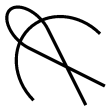

#  Workflow

## Compilation
First make sure you have rustc installed and compile the rust program inside the src-rs folder.   
```
cd src-rs
cargo build --release
```

## Configure
Change the tags in the workflow/Snakefile

## Run
snakemake -j 12 flash
